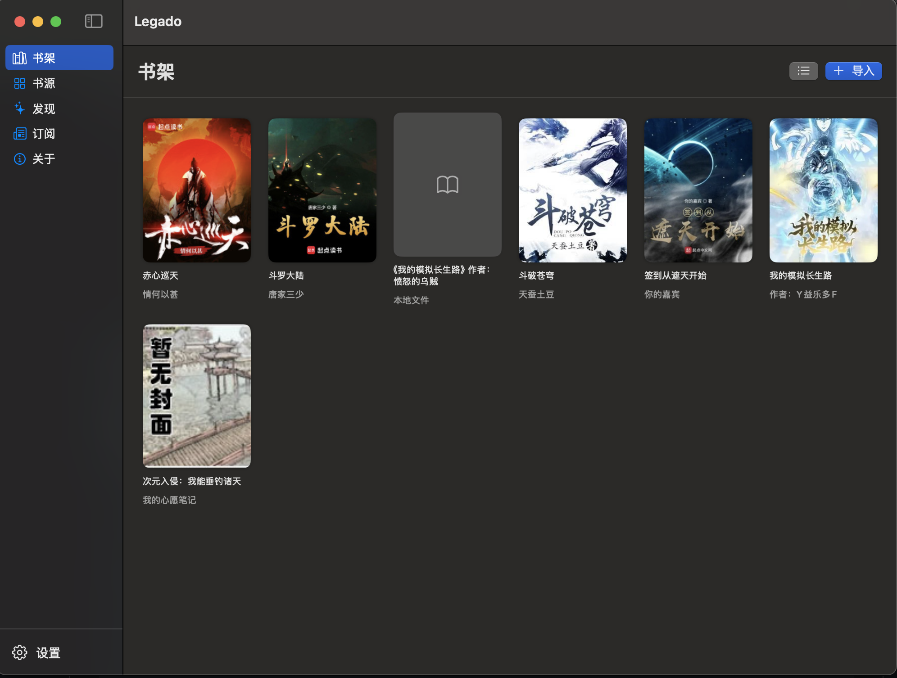
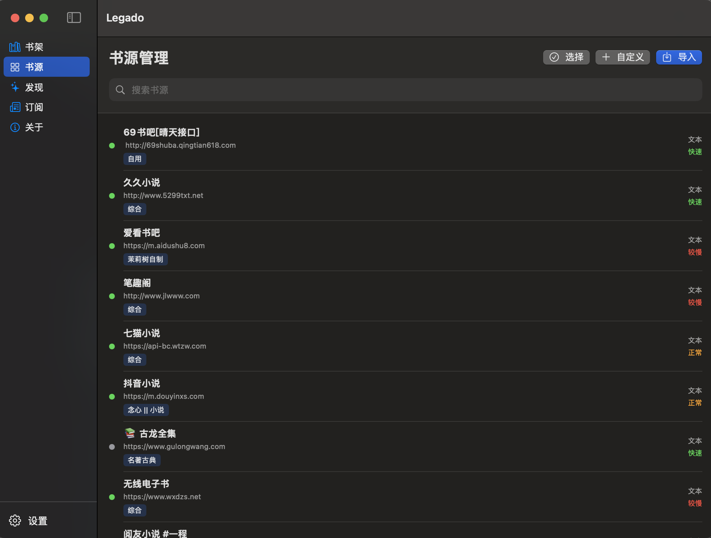
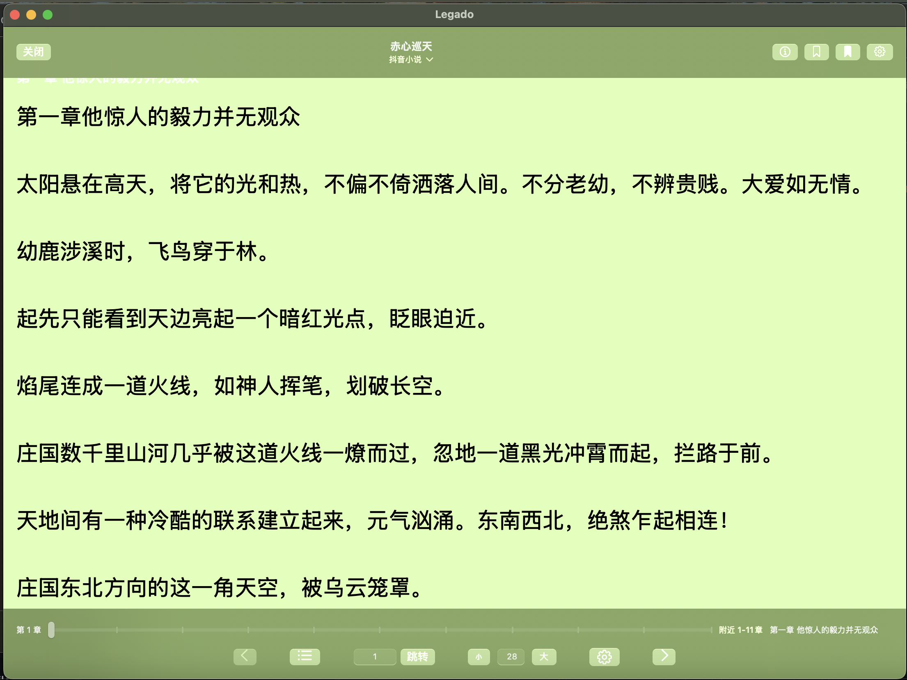
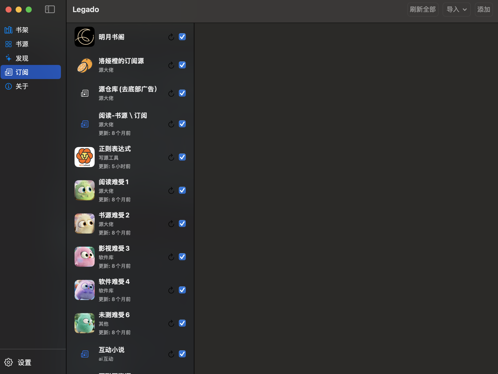
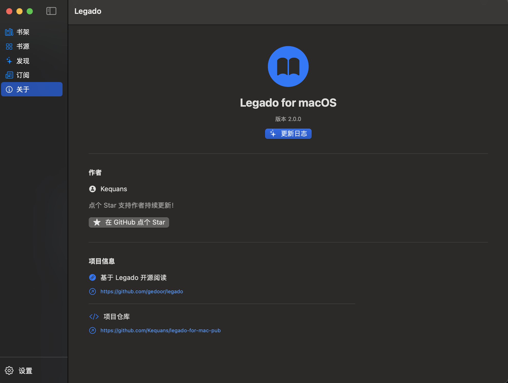

# Legado for macOS

<p align="center">
  
</p>

Legado for macOS 是基于 SwiftUI 的原生阅读器，目标是把 Android 版 Legado 的书源、书架和阅读能力迁移到 macOS，同时保留 Legado 的 JSON 规则格式。

## 当前能力

- 书源导入、编辑、启用/禁用和批量导出。
- Android 版书源 JSON、书架 JSON 导入。
- TXT 与 EPUB 本地导入、章节识别和按章节读取。
- 在线搜索、书源发现、换源、章节缓存和预加载。
- CSS、JSONPath、常见 XPath、正则和 JavaScript 规则解析。
- Android JSOUP 链式规则、索引区间/排除、连接符、AllInOne、OnlyOne 和递归 JSONPath。
- 标准 RSS/Atom、自定义 RSS 规则、分页和文章正文。
- 阅读进度、滚动位置、书签、阅读历史和替换规则。
- JSON 数据备份恢复、封面缓存、网络代理和自定义快捷键。

依赖 Android WebView、Java 类（例如 OkHttp）、登录 UI、音频/图片书专用渲染和 iCloud 同步的功能仍属于兼容边界。

## 界面预览

界面采用 macOS 原生深色布局，覆盖书架、书源、订阅、阅读和项目介绍等主要使用场景。图片按两列排列，GitHub 页面会根据屏幕宽度自动缩放。

<table>
  <tr>
    <td align="center" width="50%">
      
      <br>
      <sub>书架：管理本地书籍、在线书籍和阅读进度</sub>
    </td>
    <td align="center" width="50%">
      
      <br>
      <sub>书源：导入、筛选、启用和管理 Legado 书源</sub>
    </td>
  </tr>
  <tr>
    <td align="center" width="50%">
      
      <br>
      <sub>阅读：章节阅读、局部章节导航和阅读设置</sub>
    </td>
    <td align="center" width="50%">
      
      <br>
      <sub>订阅：管理 RSS/Atom 订阅源和文章</sub>
    </td>
  </tr>
  <tr>
    <td align="center" colspan="2">
      
      <br>
      <sub>关于：查看版本、更新日志、作者和项目地址</sub>
    </td>
  </tr>
</table>

## 快速开始

环境要求：macOS 13+、Swift 5.9+，建议使用 Xcode 15+ 或匹配的 Command Line Tools。

```bash
# 开发构建
swift build

# 运行开发版本
swift run

# 生成可双击运行的 macOS App
./build_app.sh
open Legado.app

# 生成 GitHub Release 附件（默认只打包，不上传）
./release.sh
```

build_app.sh 会自动定位当前架构的 SwiftPM Release 二进制，组装应用包，生成图标，执行 ad-hoc 签名并校验包结构。详细说明见 Docs/Guides/BUILD_APP.md。

## 仓库结构

```text
.
├── AGENTS.md                  # AI/自动化开发约束
├── DESIGN.md                  # 架构、安全边界和决策记录
├── Package.swift              # SwiftPM 工程定义
├── build_app.sh               # macOS App 构建入口
├── Sources/                   # 应用源码
│   ├── App/                   # App 入口和全局状态
│   ├── Models/                # 领域模型
│   ├── ViewModels/            # 跨视图状态和业务协调
│   ├── Views/                 # SwiftUI 页面与组件
│   ├── BookSource/            # 书源、RSS 和规则引擎
│   ├── Database/              # GRDB 数据库和 DAO
│   ├── Network/               # URLSession 网络层
│   ├── Config/                # 应用配置
│   └── Utils/                 # 导入、缓存、通知和通用工具
├── Resources/                 # Info.plist 和 AppIcon 资源
├── Docs/
│   ├── Guides/                # 使用、构建和集成指南
│   ├── Reference/             # 书源/RSS 规则与原始参考材料
│   └── History/               # 阶段总结、修复记录和历史设计
├── Tests/Manual/              # 现有手工测试脚本
└── Scripts/                  # 辅助脚本
```

完整文件索引见 Docs/RepositoryIndex.md。

## 常用入口

| 需求 | 入口 |
| --- | --- |
| 运行项目 | swift run |
| 构建 App | ./build_app.sh |
| 生成/上传 Release | ./release.sh |
| 修改阅读器配置 | Docs/Guides/CONFIG_GUIDE.md |
| 了解 JavaScript 规则 | Docs/Guides/JAVASCRIPT_SUPPORT.md |
| 书源规则 | Docs/Reference/BookSourceRules.md |
| RSS 规则 | Docs/Reference/RSSSourceRules.md |
| 手工测试 | Tests/Manual/ |
| 开发约束 | AGENTS.md |

## 数据位置

应用运行数据位于：

```text
~/Library/Application Support/Legado/
├── legado.db             # SQLite 数据库
├── Books/                # 本地书籍源文件和章节缓存
├── covers/               # 封面缓存
├── reader_config.json    # 阅读器配置
└── main_app_config.json  # 应用配置
```

应用内「设置 → 通用 → 备份数据」会导出书架、书源、章节缓存、RSS、书签和阅读历史。恢复备份前请确认目标文件可信。

## 开发约定

新增功能应放入对应的 Sources/ 模块，并同步更新相关指南或 DESIGN.md。数据库结构变更必须通过 DatabaseManager 的迁移逻辑完成；书源和 RSS 规则应优先复用 LegadoRuleParser。

提交前至少运行：

```bash
bash -n build_app.sh
swift build
swift build -c release
git diff --check
```

## 许可证

本项目遵循 GPL-3.0。原始项目：https://github.com/gedoor/legado。
